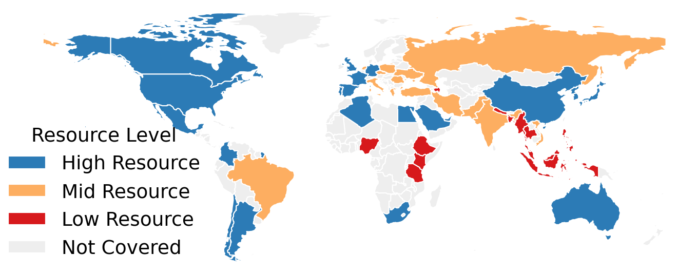

# ⚖️ GaoYao — 皋陶多语言大模型评测数据集

<p align="right">
  <a href="./README_EN.md">English</a> &nbsp;|&nbsp; <b>简体中文</b>
</p>


> **🌐 一站式多语言、多文化、多题型大模型能力评测框架**
>
> 皋陶 (GaoYao) 评测集致力于构建公平、全面的评价体系，支持**客观题**、**主观题**、**翻译题**等丰富评测场景，覆盖从基础理解到跨文化适应的完整能力维度。

---

## 🎉 GaoYao is accepted by ACL 2026 main!

---

<p align="center">
  
</p>

<p align="center"><em>GaoYao covers 26 languages across 51 nations/areas with balanced resource distribution</em></p>

---

## 🔗 核心资源 | Resources

- 📄 **论文 (Paper)**: [arXiv:2604.20225](https://arxiv.org/abs/2604.20225)
- 🤖 **Agent 一键调用 (Agentic Skill)**: [skill.md](./skill.md) — AI agent end-to-end deployment guide, from GPU verification to full evaluation

---


---

## 🤖 Skill 化 Agentic 设计

GaoYao 已封装为**标准化 Agent Skill**，支持 AI Agent 一键端到端部署与运行完整评测流程。

- **[skill.md](./skill.md)** 提供结构化 7 步指南：GPU 验证 → 依赖安装 → 环境配置 → vLLM 启动 → 评测运行 → 结果解读
- 支持 **标准 GPU (sm_70+)** 和 **Blackwell GPU (sm_120, RTX 50系)** 两种部署路径，自动 patch 兼容
- 支持**两阶段评测**：推理与评分解耦，适配海外 GPU 机器无法访问 judge API 的场景
- 任何兼容 Claude Code / OpenAI Function Calling 的 Agent 框架均可直接调用

---

## 项目简介

GaoYao 是一个系统化的多语言多文化评测基准，构建了涵盖通用多语言能力、跨文化能力和单一文化能力的三维度九子项评估框架。该基准将指令遵循与多轮对话测试集通过语言专家人工精译扩展至 19 种语言，语言覆盖较现有工作提升 111%。针对文化能力，采用专家参与的数据合成方法覆盖 34 种文化，文化代表性提升 88%。评测整合高质量人工校验数据，避免纯机器翻译的质量缺陷。最终对 15 余个主流开源与商业大模型开展分层评估，为多语言多文化能力提供全面可靠的衡量标准。

---

## 📁 代码架构

```
GaoYaoEval/
├── data/                          # 数据层
│   └── original/                  # 原始评测数据集
│       ├── MGSM/
│       ├── MMMLU/
│       ├── Belebele/
│       ├── Include/
│       ├── Flores101/
│       ├── SuperBLEnD/
│       ├── S-AlpacaEval/
│       ├── S-MT-Bench/
│       ├── SAGE/
│       └── CultureScope/
│
├── results/                       # 输出目录（运行时生成）
│   └── <model-name>/
│       ├── inference_result/      # 推理结果缓存
│       │   └── <dataset>/infer.jsonl
│       └── evaluation_result/     # 评测分析结果
│           └── <dataset>/
│               ├── metrics.json   # 指标汇总
│               ├── bad_cases.jsonl
│               └── not_pass.jsonl
│
├── src/                           # 核心代码
│   ├── evaluation/                # 评测引擎
│   │   ├── base_eval.py           # 评测基类
│   │   ├── config.py              # 评测配置
│   │   └── {dataset}_eval.py      # 各数据集评测实现 (10 个)
│   ├── inference/
│   │   └── infer.py               # 推理模块（vLLM API + 本地 transformers）
│   ├── pipeline/
│   │   └── pipeline.py            # 评测流水线主控
│   ├── tools/                     # 通用工具
│   │   ├── file_operations.py
│   │   ├── judger_algorithm.py
│   │   ├── llm_request.py         # 推理/Judge/COMET 请求封装
│   │   ├── metrics_and_report_operator.py
│   │   ├── prompt_templates.py
│   │   └── text_processing.py
│   └── log/
│       └── logging_config.py
│
├── scripts/                       # 一键部署脚本（skill.md 使用）
│   ├── bootstrap.sh               # 幂等环境装配（依赖 / 模型 / patch 一次过）
│   ├── check_gpu.sh               # GPU 能力门槛检查
│   ├── patch_vllm_blackwell.py    # sm_120 vLLM 兼容补丁
│   ├── start_vllm.sh              # vLLM 服务启动（sm_120 自动 patch）
│   ├── wait_vllm.sh               # 等待 vLLM 就绪
│   └── run_preset.sh              # 评测 preset 封装（smoke/lang10/full/stage1/stage2）
│
├── run_eval.py                    # 主入口
├── skill.md                       # Agent 一键调用指南
├── requirements.txt
└── LICENSE
```

---

## 📊 数据规范

### 📋 推理结果字段 (`inference_result/<dataset>/infer.jsonl`)

| 编号 | 字段名     | 定义               | 必选 | 示例值          |
|------|------------|--------------------|------|-----------------|
| 1    | `uuid`     | 唯一标识           | ✅   | `"uuid-001"`    |
| 2    | `prompt`   | 问题（提示词）     | ✅   | `"法国首都是?"` |
| 3    | `response` | 模型推理结果       | ✅   | `"巴黎"`        |
| 4    | `gt`       | 参考答案           | ✅   | `"Paris"`       |
| 5    | `language` | 语种               | ❌   | `"fr"`          |
| 6    | `country`  | 地区               | ❌   | `"France"`      |

### 📈 评测结果扩展字段 (`evaluation_result/<dataset>/`)

| 编号 | 字段名        | 定义                                   | 适用题型 | 必选       |
|------|---------------|----------------------------------------|----------|------------|
| +1   | `judge_score` | 评测得分                               | 客观题   | 客观题 ✅  |
| +2   | `prediction`  | 标准化抽取结果                         | 客观题   | 客观题 ✅  |
| +3   | `winner`      | 胜率结果 (`win`/`lose`/`tie`)         | 主观题   | 主观题 ✅  |
| +4   | `bad_case`    | 异常响应原始记录                       | 全类型   | ❌         |
| +5   | `not_pass`    | 未通过用例原始响应                     | 全类型   | ❌         |

> 评测结果自动继承推理结果全部字段，并追加上述扩展字段

---

## ⚙️ 快速开始

### 环境准备

```bash
git clone https://github.com/lunyilui/GaoYao.git
cd GaoYao
pip install -r requirements.txt
pip install vllm          # 需要 CUDA sm_70+ (V100 / RTX 20系 或更新)
```

### 配置环境变量

```bash
export GAOYAO_API_KEY=<your_api_key>          # judge 调用所需
export GAOYAO_JUDGE_MODEL=<judge_model_name>  # judge 模型名称
export GAOYAO_JUDGE_BASE_URL=<judge_api_url>  # judge API 端点
```

### 启动推理服务

```bash
# 标准 GPU (sm_70+)
bash scripts/start_vllm.sh <hf_model_id>

# Blackwell GPU (sm_120, RTX 50系) — 先 patch vllm，再启动
python3 scripts/patch_vllm_blackwell.py
nohup python3 -m vllm.entrypoints.openai.api_server \
    --model <hf_model_id> --served-model-name <model_name> \
    --port 8000 --dtype float16 --max-model-len 8192 \
    --gpu-memory-utilization 0.85 --trust-remote-code --enforce-eager \
    > /tmp/vllm.log 2>&1 &
```

### 运行评测

```bash
# 1% 快速验证（全量随机采样）
python run_eval.py \
    --model-url http://localhost:8000/v1/chat/completions \
    --model-name <model_name> \
    --sample-pct 1

# 按语言分层采样 10%（每种语言各取 10%，避免低资源语言被漏采）
python run_eval.py \
    --model-url http://localhost:8000/v1/chat/completions \
    --model-name <model_name> \
    --sample-lang-pct 10

# 全量运行
python run_eval.py \
    --model-url http://localhost:8000/v1/chat/completions \
    --model-name <model_name> \
    --datasets all

# 指定数据集
python run_eval.py \
    --model-url http://localhost:8000/v1/chat/completions \
    --model-name <model_name> \
    --datasets mgsm,mmmlu,belebele,include
```

### 自定义 Judge 模型

Judge 模型用于主观题评分（S-AlpacaEval、S-MT-Bench）和 MMMLU 答案提取兜底，通过环境变量配置，也可通过 CLI 参数直接指定：

```bash
python run_eval.py \
    --model-url http://localhost:8000/v1/chat/completions \
    --model-name <model_name> \
    --judge-url https://<your_judge_api>/v1/chat/completions \
    --judge-name <judge_model_name>
```

或通过环境变量：

```bash
export GAOYAO_JUDGE_BASE_URL=https://<your_judge_api>/v1
export GAOYAO_JUDGE_MODEL=<judge_model_name>
export GAOYAO_API_KEY=<your_api_key>
```

### CLI 参数说明

| 参数               | 默认值                                         | 说明                                             |
|--------------------|------------------------------------------------|--------------------------------------------------|
| `--model-url`      | `http://localhost:8000/v1/chat/completions`    | 推理端点                                         |
| `--model-name`     | —                                              | 模型名称（必填）                                 |
| `--judge-url`      | 同 `--model-url`                               | Judge LLM 端点                                   |
| `--judge-name`     | 同 `--model-name`                              | Judge 模型名称                                   |
| `--data-dir`       | `data/original`                                | 数据集目录                                       |
| `--output-dir`     | `results`                                      | 结果输出目录                                     |
| `--datasets`       | `all`                                          | 逗号分隔的数据集列表或 `all`                     |
| `--sample-pct`     | `100`                                          | 全量随机采样百分比 (1–100)                       |
| `--sample-lang-pct`| —                                              | 按语言分层采样百分比，每种语言各取 x%（优先于 `--sample-pct`） |
| `--workers`        | `4`                                            | 并发推理 worker 数                               |
| `--skip-inference` | off                                            | 跳过推理（已有缓存时使用）                       |
| `--no-ref`         | off                                            | 不显示 Paper 参考值对比                          |

### 自定义评测

```python
from src.evaluation.base_eval import BaseEval

class MyDatasetEval(BaseEval):
    def evaluate(self, data_list: list) -> dict:
        # 实现评测逻辑，返回 metrics dict
        pass
```

---

## 📊 数据集全景图 | Dataset Overview

| ID | 评测集名称 (Dataset) | 题型 (Type) | 核心能力 (Capability) | 评测维度 (Dimension) |
|:--:|:---------------------|:-----------:|:----------------------|:---------------------|
| **01** | `belebele`      | 🧩 客观题 | 多语言阅读理解     | **Reading Comprehension** |
| **02** | `mgsm`          | 🧩 客观题 | 多语言数学推理     | **Math**                  |
| **03** | `mmmlu`         | 🧩 客观题 | 多学科知识综合     | **Reasoning**             |
| **04** | `superblend`    | 🧩 客观题 | 混合领域综合能力   | **Cross-Culture**         |
| **05** | `include`       | 🧩 客观题 | 文化包容性评测     | **Knowledge**             |
| **06** | `culture_scope` | ⚖️ 混合题 | 单文化场景深度评测 | **Mono-Culture**          |
| **07** | `sage`          | ⚖️ 混合题 | 跨文化理解与适应   | **Cross-Culture**         |
| **08** | `s_alpaca_eval` | 🖋️ 主观题 | 复杂指令遵循能力   | **Instruction Follow**    |
| **09** | `s_mt_bench`    | 🖋️ 主观题 | 多轮对话质量评估   | **Dialogue**              |
| **10** | `flores`        | 🔄 翻译题 | 高质量机器翻译     | **Translation**           |

---

## 💡 扩展性设计

- **插件式评测器**：通过继承 `BaseEval` 快速接入新数据集
- **统一数据契约**：标准化输入/输出字段，降低集成成本
- **Judge 可替换**：通过 `--judge-url` / `--judge-name` 或环境变量切换任意 OpenAI-compatible judge 模型
- **分层采样**：`--sample-lang-pct` 确保低资源语言不被随机漏采，适合快速验证场景

---

## 📚 引用 | Citation

若本项目对您的研究有帮助，请引用我们的论文：

```bibtex
@misc{liu2026gaoyaobenchmarkcomprehensiveframework,
      title={The GaoYao Benchmark: A Comprehensive Framework for Evaluating Multilingual and Multicultural Abilities of Large Language Models}, 
      author={Yilun Liu and Chunguang Zhao and Mengyao Piao and Lingqi Miao and Shimin Tao and Minggui He and Chenxin Liu and Li Zhang and Hongxia Ma and Jiaxin Guo and Chen Liu and Liqun Deng and Jiansheng Wei and Xiaojun Meng and Fanyi Du and Daimeng Wei and Yanghua Xiao},
      year={2026},
      eprint={2604.20225},
      archivePrefix={arXiv},
      primaryClass={cs.CL},
      url={https://arxiv.org/abs/2604.20225}, 
}
```
